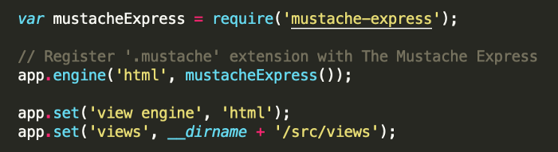
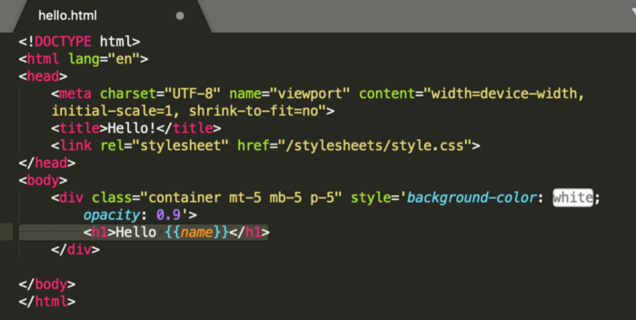

# JavaScript

### Javascript Templating
Javascript templating is a fast and efficient technique to render client-side view templates with Javascript by using a JSON data source.

##  Mustache.js
Mustache is a logic-less template syntax.

**logic-less:** doesn't have if statements or loops; just tags and values.

### Mustache 
Mustache supports various languages, for JavaScript we use Mustache.js

* to use mustache.js, we need to install it first, there is two ways to do that:
    1. Yarn:
        ```
        $ yarn add mustache-express
        ```
    2. NPM:
        ```
        $ npm install mustache --save
        ```
#### How to use Mustache.js

1. app.js file:
    
2. inex.html file:
    
3. app.js file:
    ``` JS
        var nameObject = {"name": "Sherlynn"}
        res.render('hello', nameObject)
    ```
4. Result:
    


---

# CSS

## Flexbox
``` css
    .container {
        display: flex || inline-flex;
        flex-direction: row || column || row-reverse || column-reverse;
        flex-wrap: wrap || nowrap || wrap-reverse;
        flex-flow: flex-direction flex-wrap;
        justify-content: space-between; /* horizontally */
        align-items: center; /* vertically */
        align-content: space-around; /* multi-line */
        order: 2 || 1 || 0 || -1 || -2;
        flex-grow: 4;
        flex-shrink: 3;
        align-self: end; /* for one item */
    }
```


### Flexbox Froggy Game

.png)