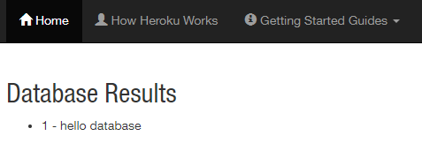

# Heroku
Heroku is a cloud platform as a service supporting several programming languages. One of the first cloud platforms, Heroku has been in development since June 2007, when it supported only the Ruby programming language, but now supports Java, Node.js, Scala, Clojure, Python, PHP, and Go.

### Set up
```
heroku login
```
This command opens your web browser to the Heroku login page. If your browser is already logged in to Heroku, simply click the Log in button displayed on the page.

```
node --version
v12.20.0


npm --version
7.5.3

git --version
git version 2.25.1
```

### Prepare the app
```
git clone https://github.com/heroku/node-js-getting-started.git
cd node-js-getting-started
```


### Deploy the app
```
heroku create
git push heroku master
heroku ps:scale web=1
heroku open
```


### View logs
```
heroku logs --tail
```


### Tutorial
