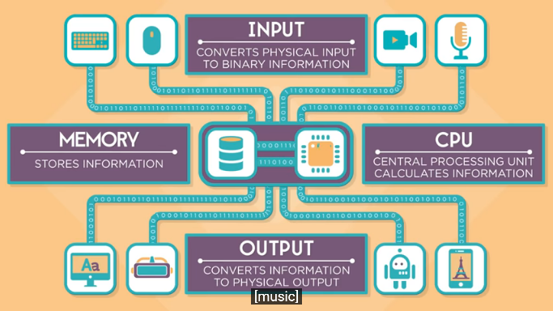

# How computers work:

**Computer:** A device that manipulates information and does thinkings.

---
## What Makes a Computer, a Computer?

To call a device a computer, or what is common in all computers, is 4 different tasks, they are:
- Input.
- Storage.
- Process.
- Output

### Input:
Everything you tell the computer!
### Storage:
The input information that needs processing.
### Process:
Takes information from memory to manipulate and then store again.
### Output:
Everything that comes back from the memory.

---
## CPU, Memory, Input & Outputs

What parts of the computer do each task and how?

### Input examples:
Computer keyboard, phone touchpad, camera, microphone, GPS, sensors, and thermostats ...etc

So, when you give the **input** device a value, a letter on the keyboard, for example, that letter will be converted to a binary number by the keyboard, and this number will be sent  through circuits to the **CPU (Central Processing Unit)**, which will calculate how to display it to the screen, pixel by pixel, by requesting this information from the **Memory** which will give this information to the **CPU** which will run it and store it back to the **memory**, finally, this pixel information will be sent to the **Output** device as binary, the **output** device, the screen, will convert the binary numbers to tiny lights and colors to show the letter on the screen.

### Output examples:
Display, speakers, printers, robotic arm, car motor ...etc

---
## Hardware & Software

#### Hardware examples:
Circuits, chips, wires, plugs, speakers ...etc
#### Software examples:
Apps, games, websites, maps, programs ...etc

### How they interact together?
using CPU!

**The CPU** is a master chip that controls everything n the computer! It has many circuits inside and each circuit has a different task to do.

The software tells the **CPU** which circuit to run, but when you multitask, the **CPU** runs multiple software at once.

### How is that controlled?
using OS!

**The Operating Systems (OS)** is the master program that manages how the software uses the hardware of a computer. It controls other software, like downloading programs.

So when you run more than one program, **the OS** is quickly switching between programs in fractions of seconds.